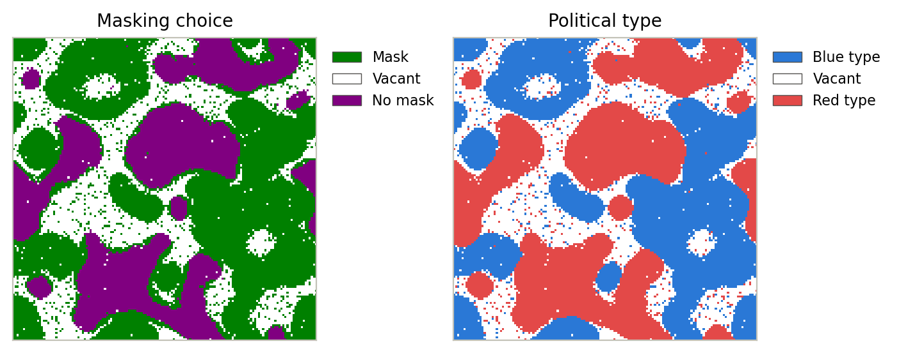

# segregation_amplification

[](https://github.com/jandrewjohnson/segregation_amplification/actions/workflows/tests.yml)
[](LICENSE)

An agent-based model that places Thomas Schelling's **binary choice with externalities** (1973) inside his **segregation model** (1971). Agents first sort themselves in space by political type, then decide whether to wear a mask based on their own preferences and on the reciprocal response of their neighbors. The model shows how segregation amplifies polarized behavior: the same population that masks almost universally when mixed splits into masked Blue neighborhoods and unmasked Red neighborhoods once it has sorted.

This repository contains the code and figure scripts for:

> Johnson, J. A. and C. F. Runge. *Thomas Schelling's Political Economy: Polarized Communities and Amplified Division.*



## Quick start

```bash
git clone https://github.com/jandrewjohnson/segregation_amplification.git
cd segregation_amplification

# Option A: conda (pins the versions used for the paper)
conda env create -f environment.yml
conda activate segregation_amplification

# Option B: an existing Python >= 3.10 environment
pip install -e ".[test]"

python make_figures.py   # regenerates Figures 2-6 into figures/ (about 5 seconds)
pytest                   # runs the test suite
```

The core simulation loop is written in Cython. `pip install -e .` compiles it automatically; you need a C compiler (Xcode Command Line Tools on macOS, `build-essential` on Linux, or the MSVC Build Tools on Windows).

## Reproducing the paper's figures

`python make_figures.py` rebuilds every simulation figure in the paper from a fixed seed. Each PNG has a JSON file next to it that records the seed, grid size, iterations and every model parameter, along with the package versions that produced it. Use `--only` to build a subset, and `--seed` to check that a result is robust to the random draw.

| Paper figure | Output | Function in [`figures.py`](segregation_amplification/figures.py) | Setup |
|---|---|---|---|
| Figure 1 | Conceptual diagram, not generated by code | | |
| Figure 2 | `figures/fig2_aspatial_masking.png` | `figure_2_aspatial` | Aspatial game, 20 × 20 grid of (μ_d, μ_r), 50 agents per cell |
| Figure 3 | `figures/fig3_segregation_over_time.png` | `figure_3_segregation_over_time` | 150 × 150 grid, political type at iterations 0-100 |
| Figure 4 | `figures/fig4_masking_over_time.png` | `figure_4_masking_over_time` | Same run as Figure 3, masking choice at iterations 1-100 |
| Figure 5 | `figures/fig5_segregation_threshold.png` | `figure_5_segregation_threshold` | 100 × 100 grid, τ ∈ {0.11, 0.25, 0.46}, 100 iterations |
| Figure 6 | `figures/fig6_spatial_adjacency.png` | `figure_6_spatial_adjacency` | 150 × 150 grid, 40 iterations |
| Figure 7 | Reproduced from Gounaridis & Newell (2024) | | |

All runs use the default parameters below unless the table says otherwise. The default seed is 1.

## How the model works

Agents live on a grid that wraps around at the edges (a torus). 75% of cells are occupied, and each agent is randomly assigned one of two political types, **Blue** (type 1) or **Red** (type 2). Each agent's neighborhood is the (2G+1) × (2G+1) window of cells around it.

**Stage 1: segregation.** Each iteration, every agent looks at its neighborhood. If the share of neighboring cells that are *not* occupied by its own type (the other type or vacant) is at least τ, the agent moves to a randomly chosen vacant cell. The simulation stops early once no agent wants to move.

**Stage 2: binary choice with externalities.** Each agent chooses to mask (m = 1) or not (m = −1) to maximize

  U(m_i) = m_i · (d_i + s_i · r̄_i)

where d_i is the agent's direct utility from masking, s_i is the weight it places on social response, and r̄_i is the average reciprocal response r_j of the agents in its neighborhood. Reciprocal responses depend on type: r_j = r for Blue agents and r_j = r · b for Red agents. With b < 0, Red neighbors reward not masking. An agent in a mixed neighborhood therefore faces mild social pressure, while an agent surrounded by its own type faces strong pressure to follow that type's norm.

Each agent's d, s, r and b are drawn from normal distributions truncated to [−10, 10].

**Infection (extension).** The model also includes a simple infection process: infected neighbors can pass on infection, which masking and immunity reduce. The paper's results do not use it; it affects neither where agents move nor whether they mask. It is shown in the interactive viewer.

The aspatial game (Figure 2) is the same choice rule with every agent in every other agent's neighborhood, so space plays no role. It is implemented in [`aspatial.py`](segregation_amplification/aspatial.py).

## Parameters

Defaults are in `DEFAULT_PARAMS` in [`model.py`](segregation_amplification/model.py). Override any of them with `SegregationMaskingModel(params={...})`.

| Code name | Symbol | Default | Meaning |
|---|---|---|---|
| `segregation_threshold` | τ | 0.55 | An agent moves when at least this share of its neighborhood is not its own type |
| `neighborhood_radius` | G | 3 | Neighborhood is the (2G+1)² − 1 surrounding cells (G = 3 → 48 neighbors) |
| `d` / `dd` | d, μ_d | −0.25 / 1e−7 | Mean / s.d. of direct utility from masking |
| `s` / `sd` | s | 1.0 / 1e−7 | Mean / s.d. of the weight on reciprocal response |
| `r` / `rd` | r, μ_r | 3.0 / 1e−7 | Mean / s.d. of type-agnostic reciprocal response |
| `b` / `bd` | b | −0.1 / 1e−7 | Mean / s.d. of the Red-type multiplier on r |
| `infection_probability` | | 0.005 | Per-contact infection probability (infection extension) |
| `masking_efficacy` | | 0.55 | Reduction in infection probability from masking (infection extension) |
| `infection_duration` | | 10 | Iterations an agent stays infected (infection extension) |
| `immunity_decay` | | 0.99 | Per-iteration decay of post-infection immunity (infection extension) |

Other settings on the model object: grid size (`spatial_shape`, default 75 × 150), `proportion_filled` (0.75) and `seed`.

## Using the model from Python

```python
from segregation_amplification import SegregationMaskingModel

model = SegregationMaskingModel((150, 150), seed=1, params={'segregation_threshold': 0.46})
model.update(100)                  # run up to 100 iterations (stops early at equilibrium)

model.types_map                    # 0 = vacant, 1 = Blue, 2 = Red
model.masking_choice               # 0 = vacant, 1 = mask, -1 = no mask
model.get_masking_rate()           # share of agents masking
```

A given seed reproduces a run exactly. All randomness (placement, types, parameter draws, relocation and infection) comes from one generator.

## Interactive viewer

```bash
python -m segregation_amplification.interactive --rows 100 --cols 100 --seed 1
```

This opens a live window showing masking choice, political type, infection and immunity, with sliders for τ, G, the infection probability, and d, s, r and b. While the pointer is over a panel, you can edit the agent under it:

| Key or mouse | Effect |
|---|---|
| `a` / `q` | Set the cell's type to Blue / Red |
| `s` / `w` | Raise / lower the agent's r by 0.5 |
| `d` / `e` | Raise / lower the agent's d by 0.5 |
| click | Infect the agent |

The viewer needs an interactive Matplotlib backend. The default one on macOS and Windows works; on Linux, install `PyQt5` or `tk`.

## Optional: running through hazelbean's ProjectFlow

The model was developed inside [hazelbean](https://github.com/jandrewjohnson/hazelbean_dev)'s ProjectFlow task framework. If you use that framework, `run_segregation_amplification.py` runs the same work as a task tree: it builds Figures 2-6, then opens the interactive simulation. Nothing else in the repository needs hazelbean, and it is not installed by default:

```bash
pip install -e ".[projectflow]"      # adds hazelbean >= 2.0 (brings in GDAL; conda-forge is the easiest source)
python run_segregation_amplification.py
```

Outputs are written beside the repository, never inside it, to `../projects/segregation_amplification/intermediate/paper_figures/`. Figures that already exist are kept on reruns. To open only the interactive simulation, set `p.tasks_to_skip = ['paper_figures']` in the file's `__main__` block. `p.world_shape` and `p.seed` there set the viewer's grid and seed.

## Repository layout

```
segregation_amplification/
  model.py         SegregationMaskingModel: agents, parameters and state
  core.pyx         Cython simulation loop (segregation moves, masking choice, infection)
  aspatial.py      Aspatial game used for Figure 2
  figures.py       One function per paper figure
  interactive.py   Live viewer
make_figures.py    Command-line entry point that regenerates the paper figures
run_segregation_amplification.py   Optional hazelbean ProjectFlow entry point (figures + interactive viewer)
figures/           Committed outputs of make_figures.py, with parameter records
tests/             pytest suite (reproducibility, conservation, segregation, aspatial analytics)
```

## Citation

If you use this code, please cite the paper above. Citation metadata is in [`CITATION.cff`](CITATION.cff); GitHub's "Cite this repository" button reads it.

## License

MIT; see [LICENSE](LICENSE).

## Contact

Justin Andrew Johnson, Department of Applied Economics, University of Minnesota (jajohns@umn.edu).
